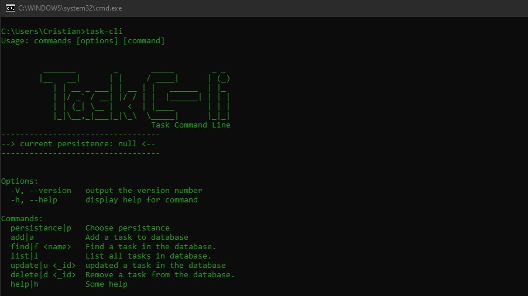
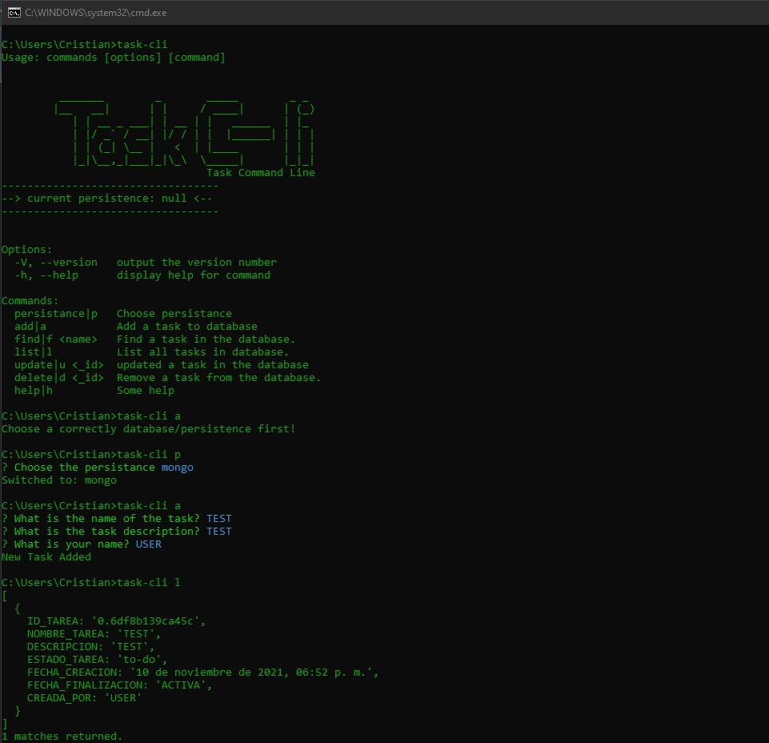

## Task Command-line

Command line application to create, update, edit and delete tasks  
When you edit, you can finish a task. 
By default, the tasks are in an "to-do" status, you can edit them to "in-progress" or "finished".  
If you finish the task, an end date will be added.


### HOW TO INSTALL:


```
npm install  
```


### Basic configuration:

You have to put your MySQL and Mongo database access data in the file databaseConfig.j located in the root.

```
const mysqlConfig = {
    host: "localhost",
    port: 3306,
    user: 'root',
    password: '1234',
    database: 'taskcli-test',
};

const mongoConfig = {
    host: "localhost",
    port: 27017,
    database: 'taskcli-test',
};
```


### HOW TO USE:

Two ways to spread it:
  
1. Tip in your terminal ``` npm install -g ./```  
_The g in npm install -g is a flag signifying that you want to install that particular npm module system wide (globally)._


2. Tip in your terminal ```npm link```  
_This 'means to symlink a package folder'. Put simply, it's a means to connect your parent application to a module you have locally on your machine. When you run the application, any changes you make to the dependency will be reflected in the application._

Now you can go to your terminal Bash, CMD, command prompt, etc and type:
```
task-cli
```

or directly whith Npx. Npx replaces the. node_modules/.bin (valid for PowerShell)

```
npx task-cli
```

Then you will have the interface on the console like this and you can interact with it:





>By default persistence is NULL, you must choose persistence first. ```task-cli p``` (alias) or ```task-cli persistence```


## Now you can use the application by means of commands
You can use the command or directly the alias   

---
**Choose persistence**  
- comand: ```task-cli persistence```   
or alias ```task-cli p```

**Add a task**  
- comand: ```task-cli add```   
or alias ```task-cli a```

**Find a task**  
- command: ```task-cli find <task name>```   
or alias ```task-cli f <task name>```

**List tasks**   
- command: ```task-cli list```   
or alias ```task-cli l```

**Update task**  
- command: ```task-cli update <task id>```  
or alias ```task-cli u <task id>```

**Delete task**  
- command: ```task-cli delete <task id>```  
or alias ```task-cli d <task id>```


## EXAMPLE OF HOW TO ADD A TASK IN MONGO



The first time, when you clone the repo, the database is marked in a JSON as null.   
From that moment on, the app will remember the last option

---
>If you want to change the name of the command, use another instead of "task-cli", you must change the name in the package.json and do npm-link again.
