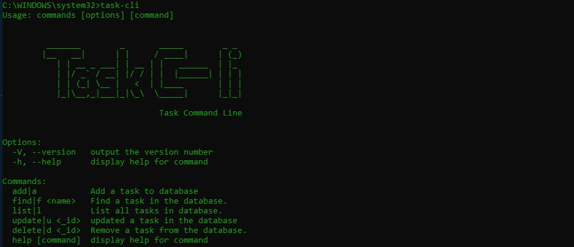

## Task Command-line
---
Command line application to create, update, edit and delete tasks  
When you edit, you can finish a task. 
By default, the tasks are in an "to-do" status, you can edit them to "in-progress" or "finished".  
If you finish the task, an end date will be added.

### HOW TO USE:
```
npm link
```
This 'means to symlink a package folder'. Put simply, it's a means to connect your parent application to a module you have locally on your machine. When you run the application, any changes you make to the dependency will be reflected in the application.

Now you can go to your terminal Bash, CMD, command prompt, etc and type:
```
task-cli
```
and make use of the program





You can use the command
e.g
```
task-cli add
```
or alias
e.g
```
task-cli a
```


---
>If you want to change the name of the command, use another instead of "task-cli", you must change the name in the package.json and do npm-link again.